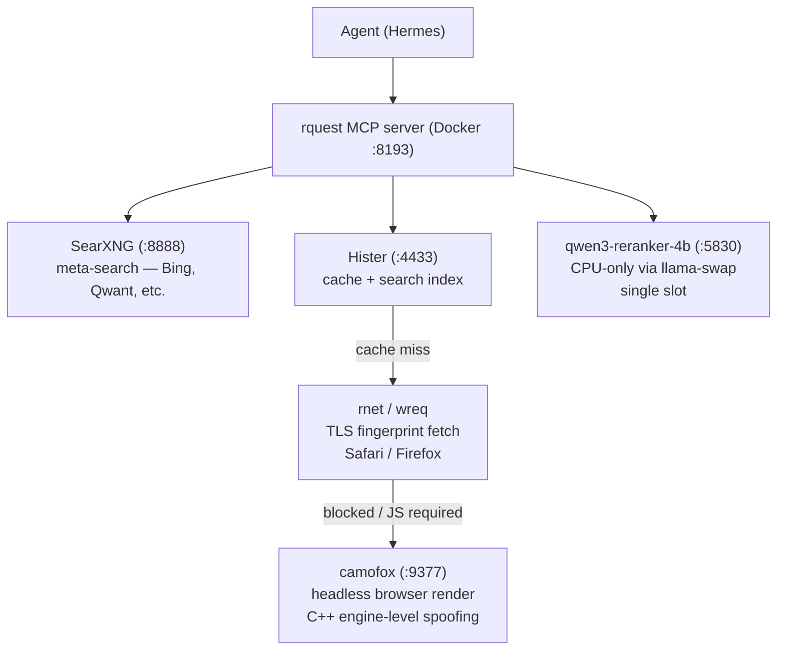

Every AI agent framework ships with web tools. Almost all of them break on real websites within a week.

The pattern is the same everywhere: you wire up a search API, add a URL fetcher, point your agent at the open web, and it works great on example.com. Then you try it on Reddit and get a 403. Cloudflare blocks the fetcher. A paywalled article returns a login page instead of content. The agent fetches a URL it already read an hour ago, burning rate limits for no reason. The page changed since you last read it, and the agent is now working from a version you never saw.

I've been running a fully local agentic web research stack for several months, and most of the value isn't in any single component. It's in the pipeline — the layered fallback that handles the real internet's anti-bot machinery, link rot, and content drift without sending anything to a cloud API.

This is a walkthrough of what's running, why each layer exists, and the specific pitfalls I hit and solved.

## Architecture

Six components running on a single host — an AMD Ryzen 9 9900X with 94 GB RAM and an RTX 5090 (32 GB VRAM). The entire pipeline shares this machine with the inference models, the agent runtime, and a dozen other self-hosted services. No cloud API calls for search, fetch, cache, ranking, or rendering.

## Component breakdown

### 1. rquest MCP server — the orchestrator

The MCP server ([mcp-rquest](https://github.com/xxxbrian/mcp-rquest)) is the single entry point. The agent never talks to the web directly — it calls MCP tools (`web_read`, `web_research`, `http_get`, etc.) and rquest handles the layered pipeline internally.

What it exposes:
- `web_read(url)` — cache-first page fetch. Checks Hister → falls back to rnet → auto-falls back to camofox render if blocked.
- `web_research(query)` — searches SearXNG + Hister cache concurrently, fetches top uncached results, optionally reranks with the local model. Auto-indexes everything for future recall.
- `web_recall(query)` — searches only the Hister cache. No web hit. Fast.
- `http_get(url)` — raw HTTP with TLS fingerprinting. No cache, no markdown extraction. For API endpoints and raw HTTP behavior.
- `http_post(url, payload)` — POST with browser fingerprinting. For APIs and form submissions.

Key design decision: the built-in web toolset in the agent framework (`web_search`, `web_extract`) is disabled at the config level. This forces everything through rquest so the cache pipeline always runs. If you leave the built-in tools enabled, the agent will sometimes bypass the cache and hit the live web, which defeats half the architecture.

### 2. Hister — persistent cache and search index

[Hister](https://hister.org) is a personal search engine that indexes pages as they're fetched. In this pipeline, it serves three roles:

**Cache layer:** Every page rquest fetches gets indexed. Cache hits return instantly with a "(cached)" marker in the output. This compounds — the more you use it, the faster routine lookups get.

**Recall layer:** The `web_recall` tool searches only the Hister index. When you ask "didn't I read something about X last week?" the agent searches Hister first, before touching the live web. This is the difference between a 2-second local search and a 30-second multi-fetch research chain.

**Stored preview layer:** This is the one that matters most and is easiest to underestimate. Hister stores the text and metadata of every page at index time. The `get_preview` MCP tool retrieves that stored content directly — no re-fetch needed. Pages change. They go behind paywalls. They get bot-blocked on repeat visits. Having the snapshot from when you actually read it means the agent works from what you saw, not what the site decides to serve an automated request three days later.

This is also particularly useful for tracking any changes to a page over time. There's been numerous times where a blog post gets pulled or lost, or I forgot where I read something, and the Hister cache had my back. A concrete example: I was researching a GitHub project that turned out to have a crypto token badge attached to its README. By the time I circled back to write about it, the badge could have been quietly removed and I'd have no evidence it was ever there. The cached version of the README in Hister is the snapshot from when I actually read it — not whatever the repo looks like today. That's the difference between having receipts and having a vague memory.

### 3. rnet — TLS fingerprint fetcher

[rnet](https://github.com/0x676e67/wreq-python) (now `wreq`) is the first-line fetcher. It impersonates real browser TLS fingerprints (Safari, Firefox) at the network layer, which bypasses basic anti-bot checks that look at TLS handshake characteristics.

Why this matters: most HTTP clients (Python requests, Go net/http, even fetch()) have distinctive TLS fingerprints that anti-bot systems flag instantly. rnet presents a fingerprint indistinguishable from a real browser session, so simple Cloudflare checks and rate limiters pass it through.

**Fingerprint strategy (learned the hard way):**

I run an 80% Safari / 20% Firefox fingerprint pool. This is not arbitrary.

- **Reddit** blocks Firefox fingerprints from datacenter IPs (403 Forbidden). Safari passes.
- **Cloudflare** managed challenges sometimes require full browser rendering regardless of fingerprint. rnet can't solve those — you need camofox.
- **GitHub** rate limits aggressively with "whoa there, pardner" regardless of fingerprint. Needs request spacing, not fingerprint rotation.
- **Newer Safari versions** (Safari18_5 vs Safari18_3_1) are less likely to be recognized by anti-bot signature databases. Lead with the newest.

The fingerprint pool lives in `server.py` as `_IMPERSONATE_POOL`. When a site starts blocking, bump to a newer Safari version first. Only add Firefox when a specific site requires it.

### 4. camofox — stealth browser server

[camofox](https://github.com/jo-inc/camofox-browser) is the last-resort renderer. It wraps [Camoufox](https://github.com/daijro/camoufox), a Firefox fork with C++ engine-level fingerprint spoofing. When rnet gets blocked (JS challenges, Cloudflare managed challenge, dynamic content), rquest falls back to a full camofox render.

The difference between camofox and standard headless browsers (Puppeteer, Playwright with Firefox): camofox modifies the browser engine itself to spoof navigator properties, WebGL renderer strings, canvas fingerprints, and other signals at the C++ level. JavaScript-based spoofing (injecting `navigator.webdriver = false` etc.) is detectable because anti-bot systems can cross-reference the spoofed values against the actual browser engine behavior. C++-level spoofing makes the entire browser consistent.

**When to force a render vs let it auto-fallback:**
- `web_read(url)` auto-falls back to camofox when it detects a block. This is the default and works for most cases.
- `http_get(url, render=True)` forces camofox immediately. Use this when you know the site requires JS (Reddit new UI, single-page apps, interactive docs).
- If a render fails (timeout, infinite redirect), the site has aggressive anti-bot that even camofox can't handle. At that point you need VNC (see Pitfalls).

### 5. SearXNG — meta-search engine

[SearXNG](https://searxng.org) is a self-hosted meta-search engine that aggregates results from multiple search backends. In this pipeline, it's the search layer that `web_research` calls to find relevant pages across the web.

The engine configuration matters more than people realize — not all search backends behave the same way for technical queries:

- **Enabled**: Bing, Qwant, Wikipedia, GitHub
- **Disabled**: Google (too aggressive with bot detection on self-hosted instances), DuckDuckGo (rate limits), Brave (requires API key)
- **Hister as an engine**: SearXNG can query Hister directly as a search engine via its `json_engine` adapter. This is configured but currently disabled — the `web_recall` MCP tool covers this use case more cleanly with better metadata.

The key insight: **SearXNG gives you search results ranked by search engine relevance.** That's fine for discovery, but not optimal for research precision. That's what the reranker (next) is for — it reorders SearXNG results by relevance to your specific question, not by general popularity.

### 6. Local reranker — qwen3-reranker-4b

A local reranker model (qwen3-reranker-4b, Q4 quantization, ~2.5GB VRAM) runs on llama-swap alongside the inference models. When `web_research(rerank=True)` is called, fetched pages are scored for relevance to the query using this model, and results are returned ranked.

This matters because search results from SearXNG are ranked by search engine relevance, not by relevance to your specific research question. A local reranker closes that gap without an API call to Cohere or OpenAI.

**Concurrency gotcha:** The reranker runs CPU-only in single-slot mode. One call takes ~4 seconds. Six concurrent `web_research(rerank=true)` calls serialize — that's ~24 seconds wall time. Under heavy parallel load, either reduce `fetch_top` (fewer documents = faster reranking) or stagger parallel agents so they don't all rerank simultaneously. Or, run it on GPU for near instant speeds but more VRAM utilization.

## The pipeline flow — what actually happens

When the agent calls `web_research("distributed inference llama.cpp RPC")`:

1. **Cache + search (parallel):** SearXNG searches the web. Hister searches the existing index. Both run concurrently.
2. **Dedup + fetch:** Results are deduped by session lineage. Uncached top results are fetched via rnet (TLS fingerprinting). If rnet gets blocked, auto-fallback to camofox render.
3. **Index:** Every fetched page is indexed in Hister for future recall.
4. **Rerank (optional):** Fetched pages are scored by the local reranker. Results returned ranked by relevance to the query.

Total time for a 5-result query with 3 fetches and reranking: ~5-10 seconds. Cache-only recall: <1 second.

## Pitfalls — things that broke and how I fixed them

### "Simple restart doesn't pick up env var changes"

Docker `restart` does not apply new environment variables. You need `docker compose up -d --force-recreate` or recreate the container. This bit me when I changed `CAMOFOX_VNC_TIMEOUT_MS` — the value didn't take until I force-recreated. Any time you change docker-compose env vars, recreate, don't restart.

### VNC timeout defaults are too short

camofox's default VNC session timeout is 2 minutes. If you're using VNC for interactive login or debugging, 2 minutes is useless. Set `CAMOFOX_VNC_TIMEOUT_MS=14400000` (4 hours) in docker-compose. You can always toggle back to headless when done.

**VNC is NOT always-on.** The browser runs headless for all automation. VNC is an on-demand toggle via a POST to the camofox API. Toggle it on when you need visual interaction (CAPTCHA solving, manual OAuth login, debugging render failures), toggle it off when done. Rendering pauses while in virtual/display mode.

### Reddit is a special case — two layers, two tools

Reddit is where most agentic web stacks quietly die. The rnet fingerprint layer handles Reddit's 403-on-Firefox block fine for one-off page fetches (Safari fingerprints pass). But Reddit rate-limits aggressively by IP and session, and a datacenter IP making repeated requests will get throttled regardless of TLS fingerprint.

For the research pipeline, the rnet Safari fingerprint is sufficient — one-off thread reads via `web_read` work fine. But the broader lesson is worth naming: **fingerprinting gets you past "is this a real browser?" checks. Session management gets you past "is this a real user?" checks.** Reddit needs both depending on the access pattern. Many sites do — anything with rate limits per account, content gated behind login, or APIs that distinguish authenticated from anonymous traffic.

For continuous monitoring of Reddit content (RSS polling), I handle that outside this pipeline with session cookies in a separate feed reader. That's its own stack — the point here is knowing which layer to reach for when a page fetch returns a 403.

### Reranker serialization under parallel load

Covered above, but worth emphasizing: if you're running multiple agent subagents that each call `web_research(rerank=true)` concurrently, the reranker becomes a bottleneck. Options:
- Reduce `fetch_top` per call (fewer docs to rerank)
- Stagger parallel agents
- Move the reranker to GPU (only ~2.5GB VRAM, the Q4 model is small)
- Accept the serialization — it's correctness over speed

### Cookie/session management for authenticated content

camofox auto-imports Netscape-format cookies from `~/.camofox/cookies/*.txt` on container start. Browser state (cookies, localStorage, IndexedDB) persists across restarts via a mounted volume.

To import cookies from your browser:
1. Export in Netscape format (6 tab-separated columns after the header comment)
2. Place in the cookies directory
3. Restart the camofox container

Use the cookies.txt extension to make this super easy. 

This lets the agent fetch authenticated content (docs behind login, private wikis, forum threads requiring membership) without wiring separate API access for each service. If the page is already in your browser session and you've exported cookies, the agent can access it.

## Compounding value — the little things

These aren't headline features. They're things that didn't seem important initially but compound over weeks of use.

### Every fetch builds the index

The cache isn't something you populate manually. Every page the agent fetches in normal operation gets indexed. After a few weeks, routine lookups start hitting cache more often than not. Research speed improvements are gradual and compounding — you don't notice until you try to do the same research without the cache and realize how much you were re-fetching.

### Stored previews solve link rot silently

Pages disappear. Sites restructure. Articles go behind paywalls after going viral. The agent doesn't know the page is gone — it just gets a 404 or a login wall and moves on with incomplete information. Hister's stored preview means the agent can retrieve the content as it existed when indexed, even if the live page is gone or changed. This has saved research chains more times than I can count.

Just think back to the last time you saw [message deleted] on Reddit. 

### Local-first means no privacy calculus

Every page fetched, every search query, every indexed document stays on your infrastructure. When the agent is running on a local model, the entire pipeline — query → search → fetch → cache → rerank → inference — happens without data leaving your network. There's no tension between "I want my agent to research X" and "I don't want my browsing history sent to a cloud API."

This sounds like a nice-to-have until you're researching something sensitive (job search, health, legal) and realize the alternative is sending your full browsing context to OpenAI or Anthropic.

### The reranker makes research noticeably better

It's a small model (4B params, Q4 quant) running on CPU. But the difference between "SearXNG relevance order" and "reranked by relevance to your specific question" is night and day for research quality. The agent gets better source material to work with, which means better synthesis, which means better output. All local, no API cost.

### One search surface instead of N API integrations

Without Hister, you'd need to wire separate API access for GitHub, documentation sites, issue trackers, forums, wikis — every authenticated source. With Hister, if the useful page is already indexed (because you browsed it), the agent can search Hister instead. One search surface over material you've already accessed, rather than N integration points that each need maintenance.

## Closing

The thing about this stack isn't any individual component. It's that the layers cover each other's failures. rnet gets blocked → camofox renders. camofox can't get past a challenge → VNC for manual intervention. The page is gone → Hister has the stored preview. The search results are generic → reranker fixes the order. Everything is cached → repeat lookups are instant.

Each layer solves a real failure mode of the layer below it. That's what makes it work as a pipeline instead of a collection of tools.

And none of it leaves your network.
